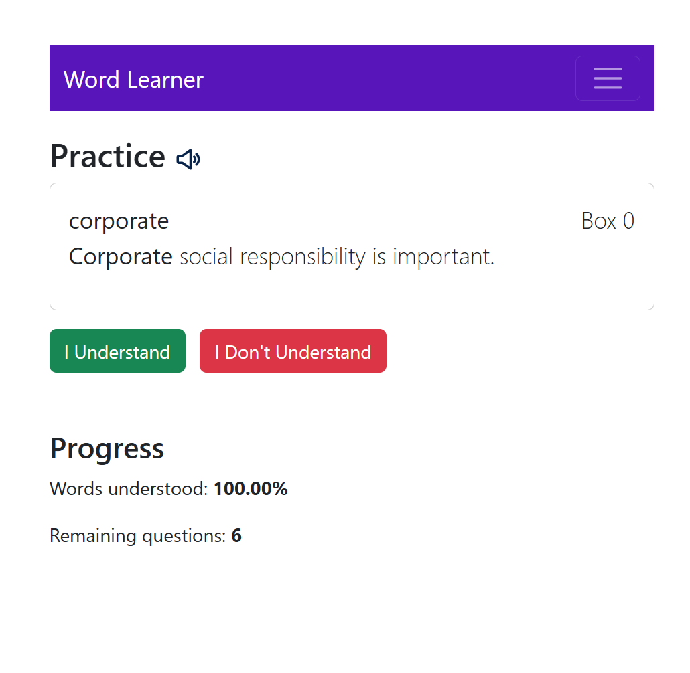
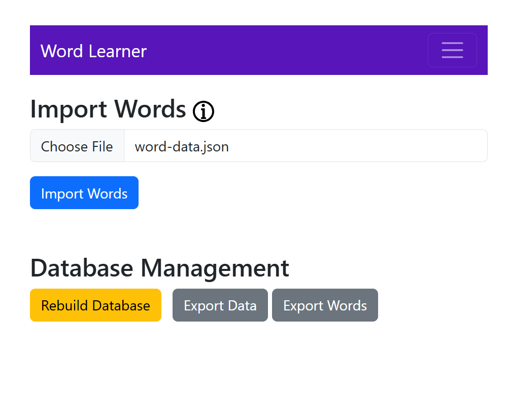
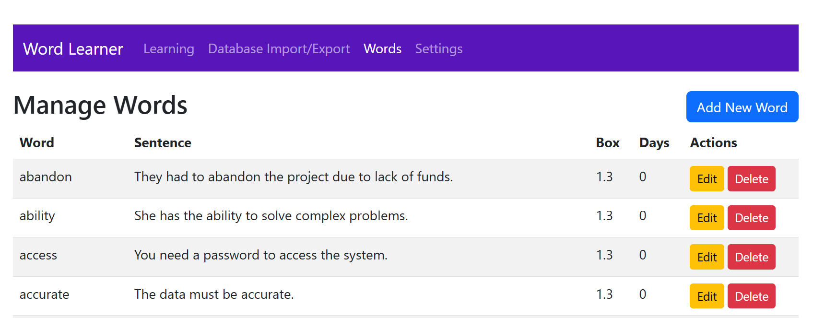

# English Word Learner App

The **English Word Learner App** is a web-based application designed to help users learn and practice new English words using the **Leitner System**. The app allows users to import words, track their progress, and review words at optimal intervals for better retention.

---

## Features

- **Practice Mode**: Learn new words with sentences and track your understanding.
- **Leitner System**: Words are reviewed at increasing intervals based on your performance.
- **Import Words**: Add new words and sentences in JSON format.
- **Manage Words**: Edit, delete, or export words and sentences.
- **Settings**: Customize the number of new words to learn per day.
- **Text-to-Speech**: Listen to the pronunciation of words and sentences.
- **Progress Tracking**: View your progress and remaining words for the day.

---

## Technologies Used

- **Frontend**: HTML, CSS (Bootstrap), JavaScript
- **Database**: IndexedDB (client-side storage)
- **Text-to-Speech**: Web Speech API
- **Icons**: Font Awesome

---

## Getting Started

### Prerequisites

- A modern web browser (e.g., Chrome, Firefox, Edge).
- Basic knowledge of JSON for importing words.

---

### Installation

1. **Clone the Repository**:
   ```bash
   git clone https://github.com/your-username/english-word-learner.git
   cd english-word-learner
   ```

2. **Open the App**:
   - Open the `index.html` file in your browser.

---

### Usage

1. **Import Words**:
   - Go to the **Import Words** section.
   - Enter words in JSON format:
     ```json
     [
       { "word": "example", "sentence": "This is an example sentence." },
       { "word": "practice", "sentence": "Practice makes perfect." }
     ]
     ```
   - Click **Import Words**.

2. **Practice Words**:
   - Go to the **Practice** section.
   - Review words and indicate whether you understand them or not.

3. **Manage Words**:
   - Go to the **Manage Words** section to edit, delete, or export words.

4. **Settings**:
   - Go to the **Settings** section to customize the number of new words to learn per day.

---

### Example JSON for Importing Words

```json
[
  { "word": "abandon", "sentence": "The crew had to abandon the ship during the storm." },
  { "word": "benefit", "sentence": "Regular exercise has many health benefits." },
  { "word": "capture", "sentence": "The photographer managed to capture the sunset perfectly." }
]
```

---

## Screenshots

  
*Practice Section: Learn new words and track your progress.*

  
*Import Words: Add new words and sentences in JSON format.*

  
*Manage Words: Edit, delete, or export words and sentences.*

---

## Contributing

Contributions are welcome! If you'd like to contribute to this project, please follow these steps:

1. Fork the repository.
2. Create a new branch (`git checkout -b feature/YourFeatureName`).
3. Commit your changes (`git commit -m 'Add some feature'`).
4. Push to the branch (`git push origin feature/YourFeatureName`).
5. Open a pull request.

---

## License

This project is licensed under the **MIT License**. See the [LICENSE](LICENSE) file for details.

---

## Acknowledgments

- **Leitner System**: Inspired by the spaced repetition technique for effective learning.
- **Bootstrap**: For the responsive and modern UI design.
- **Font Awesome**: For the icons used in the app.

---

## Contact

If you have any questions or suggestions, feel free to reach out:

- **GitHub**: [your-username](https://github.com/alised)

---

Enjoy learning new words with the **English Word Learner App**! 🎉
